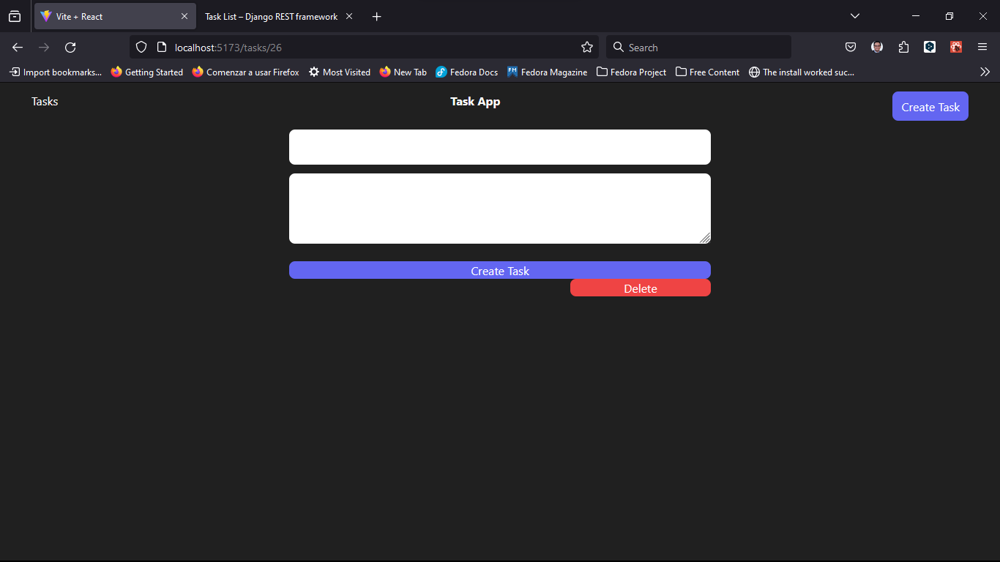

# Proyecto de Lista de Tareas con Django Rest Framework y React.



Este proyecto es una aplicación de lista de tareas que utiliza Django Rest Framework para el backend y React para el frontend.

## Configuración del entorno

Antes de comenzar, asegúrate de tener un entorno virtual Python configurado para el proyecto. Si no lo tienes, puedes crear uno usando

``` bash
python -m venv env.
```

Para activar el entorno virtual, ejecuta el siguiente comando:

``` bash
source env/bin/activate
```

Si estas en windows ejecuta el siguiente comando:

``` bash
env\Scripts\activate
```

## Ejecución del servidor de backend

El backend del proyecto se encuentra en el directorio django_crud. Para navegar a este directorio, ejecuta el siguiente comando:

``` bash
cd crud_drf_react
```

Para iniciar el servidor de desarrollo de Django, ejecuta el siguiente comando:

``` bash
python manage.py runserver
```

## Ejecución del servidor de frontend

El frontend del proyecto se encuentra en el directorio client. Para navegar a este directorio, ejecuta el siguiente comando:

``` bash
cd client
```

Antes de iniciar el servidor de desarrollo, asegúrate de instalar las dependencias necesarias con el siguiente comando:

``` bash
npm install
```

Para iniciar el servidor de desarrollo, ejecuta el siguiente comando:

``` bash
npm run dev
```

Ahora deberías poder ver la aplicación en funcionamiento en tu navegador.